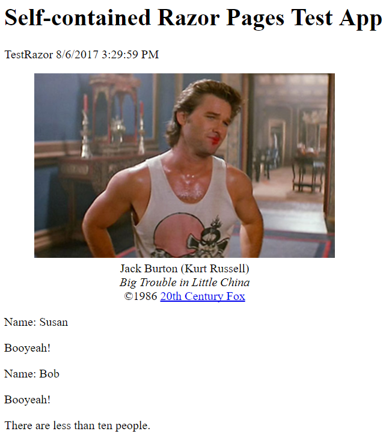

# Razor Pages Minification

This sample illustrates the use of [WebMarkupMin.Core](https://www.nuget.org/packages/WebMarkupMin.Core/) to minify the markup of Razor pages prior to the Razor engine rendering the pages.

A custom Razor Template Engine is used ...

```csharp
services.AddSingleton<RazorTemplateEngine, CustomRazorTemplateEngine>();
```

... to replace the `CreateCodeDocument` method. This allows us to hack the `inputStream` for the incoming markup, pass it off to `WebMarkupMin.Core`, then shoot it back to Razor to create the `RazorCodeDocument` ...

```csharp
using (var inputStream = projectItem.Read())
{
    using (var reader = new StreamReader(inputStream))
    {
        var text = reader.ReadToEnd();

        var markupStart = text.IndexOf("<!DOCTYPE");
        var directives = text.Substring(0, markupStart);
        var markup = text.Substring(markupStart);

        text = directives + Minify(markup);

        var byteArray = Encoding.UTF8.GetBytes(text);
        var minifiedInputStream = new MemoryStream(byteArray);

        var source = RazorSourceDocument.ReadFrom(minifiedInputStream, projectItem.Path);
        var imports = GetImports(projectItem);

        return RazorCodeDocument.Create(source, imports);
    }
}
```

`WebMarkupMin.Core` isn't so good at parsing Razor in a Razor page, so see the *Index.cshtml* page below to see how to escape sections of Razor code from the minification engine. Note that the use of `<text>` tags prevents extra spaces and CR's from those Razor line transitions from making their way into the rendered markup.

The *Index.cshtml* file starts as ...

```html
@page
@model IndexModel
@inject Microsoft.AspNetCore.Hosting.IHostingEnvironment Host
<!DOCTYPE html>
<html lang="en">
<head>
    <title>Self-contained Razor Pages Test App</title>
</head>
<body>
    <h1>Self-contained Razor Pages Test App</h1>
    <p>@Host.ApplicationName @Model.DT</p>
    <div>
        <figure style="text-align:center;width:400px">
            
            <figcaption>Jack Burton (Kurt Russell)<br><em>Big Trouble in Little China</em><br>&copy;1986 <a href="http://www.foxmovies.com/">20th Century Fox</a></figcaption>
        </figure>
    </div>
    <div>
        <!--wmm:ignore-->@for (var i = 0; i < Model.People.Count; i++)
        {
            var person = Model.People[i];
            <text><p>Name: @person</p></text>
        }<!--/wmm:ignore-->
    </div>
    <div>
        <!--wmm:ignore-->@if (Model.People.Count < 10)
        {
            <text><p>There are less than ten people.</p></text>
        }<!--/wmm:ignore-->
    </div>
</body>
</html>
```

The *Index.cshtml* file renders as ...

> \<!DOCTYPE html>\<html lang=en-US>\<head>\<title>Self-contained Razor Pages Test App\</title>\<body>\<h1>Self-contained Razor Pages Test App\</h1>\<p>TestRazor 8/6/2017 3:29:59 PM\<div>\<figure style=text-align:center;width:400px>\\<figcaption>Jack Burton (Kurt Russell)\<br>\<em>Big Trouble in Little China\</em>\<br>&copy;1986 \<a href="http://www.foxmovies.com/">20th Century Fox\</a>\</figcaption>\</figure>\</div>\<div>\<p>Name: Susan\</p>\<p>Name: Bob\</p>\</div>\<div>\<p>There are less than ten people.\</p>\</div>


